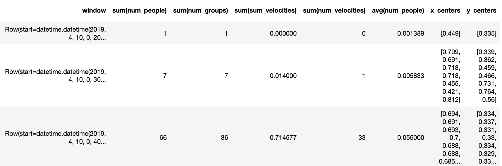

Here we describe the infrastructure, technologies, and platforms we used
throughout the entire pipeline.

## Data Pipeline

We mainly use Tensorflow distributed over GPUs for the machine learning inference and
Spark for the following data analytics.
Our pipeline looks like this:


Our project can be split up into multiple stages.

### 1. Object Detection

For object detection, we must first process the video data. 
We read in the historical video records of the Science Center Plaza and turn our collected video into 1 hour chunks.
To do much of this processing, we use `ffmpeg`. In order to mitigate overhead, we store 1 month of data as compressed video, which reduces the amount we have to store to 23.8 GB instead of 6 TB (approximately 210 GB/day for 30 days).

Once the video has been read in from the stream, we use a TensorFlow implementation of an object detection model to generate 
bounding boxes. In particular, we use a deep convolutional neural net using the Faster-RCNN architecture [1]
for detecting people, bicycles, cars, and trucks. We used a pretrained model that was trained on Microsoft COCO [2], 
a dataset of common objects in context. The dataset is composed of a large number of images with a total of 91 unique
objects with labels; however, we only care about detecting pedestrians, so we only focus on detecting one class (person). 

When feeding frames into the model, we initially considered processing video into tons of images, and then distributing those 
images, but we noted that processing uncompressed images is too slow, as EC2 instances are bottlenecked by network bandwidth. 
Therefore, in order to mitigate overhead, we instead distribute entire compressed videos to GPUs and have decompression into 
individual frames on the same node that passes them through the model.

For each frame, we end up generating a timestamp, bounding boxes, and scores for confidence of detection in each of those 
bounding boxes. We save this output data to Spark dataframes, where each row contains the output generated from one frame, which are then used when we compute our analytics. 

We run this stage of our computation on a AWS EC2 instance with GPU, in particular a p3.8xlarge instance, which has 4 GPUs
with a Deep Learning AMI (Ubuntu) Version 22.0.

The output from the machine learning model looks like this as a dataframe.
Everything else needs to be calculated, windowed, and processed using spark.

```bash
+-------------------+--------------------+--------------------+--------------------+
|              frame|              bboxes|              scores|         pair_bboxes|
+-------------------+--------------------+--------------------+--------------------+
|2019-04-10 00:00:00|[0.59336024522781...|[0.93980032205581...|[3, ...             |
|2019-04-10 00:00:01|[0.62502855062484...|[0.89926099777221...|[5, ...             |
|2019-04-10 00:00:02|[0.72911220788955...|[0.98777532577514...|[5, ...             |
|2019-04-10 00:00:03|[0.78701549768447...|[0.97126829624176...|[7, ...             |
|2019-04-10 00:00:04|[0.48519986867904...|[0.93738293647766...|[8, ...             |
|2019-04-10 00:00:05|[0.67814970016479...|[0.97286134958267...|[11, ...            |
|2019-04-10 00:00:06|[0.57940828800201...|[0.98793494701385...|[12, ...            |
|2019-04-10 00:00:07|[0.78984218835830...|[0.97743964195251...|[10, ...            |
|2019-04-10 00:00:08|[0.51487535238265...|[0.81251215934753...|[9, ...             |
+-------------------+--------------------+--------------------+--------------------+
only showing the top 9 rows
```

with only four columns for simplicity. 

Note that the pair_bboxes column contains information from the following frame. The $$k$$’th row of the pair_bboxes column is of the form:
$$[n, y1_i, x1_i, y2_i, x2_i, …, y1_j, x1_j, y2_j, x2_j]$$

where:

- $$n$$ denotes the number of people detected in the kth frame

- $$y1_i, x1_i, y2_i, x2_i$$ denote the coordinates of the bboxes (indexed by $$i$$) in frame $$k$$

- $$y1_j, x1_j, y2_j, x2_j$$ denote the coordinates of the bboxes (indexed by $$j$$) in frame $$k+1$$

Previously, we stored an extra column of the bounding boxes of the next frame so that we could compute the velocity. This required using 2 columnsa at the same time. However, PySpark was reverting to 1 worker and 1 core to process UDFs with 2 columns, so we chose to store the data in this way so that we could compute the velocity ocess this data in a udf that takes in just 1 column, and parses the input array similar to:
$$n$$ = array[0]
$$frame_k$$ bboxes = array[1:4*n+1]
$$frame_{k+1}$$ bboxes = array[4*n+1:]

The corresponding schema of the DataFrame is:

```bash
root
 |-- frame: timestamp (nullable = false)
 |-- bboxes: array (nullable = true)
 |    |-- element: double (containsNull = true)
 |-- scores: array (nullable = true)
 |    |-- element: double (containsNull = true)
 |-- pair_bboxes: array (nullable = true)
 |    |-- element: double (containsNull = true)
```

The Spark DataFrame is now used for our metrics.

### 2. Analytics

To perform our analytics, we apply user defined function transformations to the columns of the Spark dataframes from the 
object detection step. These analytics include locations of people, number of people, group size, and velocities. After 
computing analytics on the historical data, we also aggregate over short windows of time (ex. 10 minutes). After all analytics
computations have been completed, we write our results to a Pandas dataframe to be used in the visualization code.

We run this stage of our computation on a AWS EMR cluster with Spark. In particular, we use emr-5.23.0, which has
Spark 2.4.0 on Hadoop 2.8.5 YARN with Ganglia 3.7.2 and Zeppelin 0.8.1, and have 8 m4.xlarge worker instances on our cluster.

We now provide some more details on how our analytics transformation were done. Locations of people and number of people are both fairly straightforward, to calculate, with location computed by finding the centers of the input bounding boxes and
number of people found by just counting the number of bounding boxes. Group size and velocity computations are a bit more involved, however, and are described in detail below.

#### Group Size

To compute group size, we must determine how far apart the detected people are from each other within the same frame.
In order to do this, we use a depth-first-search. In particular, we construct a graph where the nodes are the centers of the detected people, and the edges are the distances between the centers.
We connect 2 nodes with an undirected edge *iff* the Euclidean distance between the centers is less than the threshold of 0.1, where the coordinates of the two dimensinos are given as proportinos of the overall width and length of the screen (i.e. values are in [0, 1]).

After constructing the graph, we identify the connected components through depth-first-search, where a component contains all nodes reachable from each other. The size of each component is the group size. The number of groups is the number of distinct connected components.

#### Velocity

In order to compute the average velocity in each frame, we must consider the detected objects in the next frame.
For person A in frame $$i$$, we need to identify the location of person A in frame $$i+1$$, and then approximate the velocity in frame i by dividing the distance traveled (between person A's centers) by the time, which is the inverse of the fps (frames per second).

So, first, we must link people between frames.
Since people are constantly entering and leaving the frame, the number of objects per frame ($$n_i$$) may not be consistent between successive frames.
Therefore, for each frame, we can compute at most $$\text{min}(n_i, n_{i+1})$$ velocities.
We compute pairwise distances between all objects in different frames, sort the pairs in ascending order of distance, and then greedily label each unassigned object in frame $$i$$ to the closest unassigned object in frame $$i+1$$.
We account for the edge case of a person leaving one end of the frame and another person entering on the opposite side of the next frame by only linking people whose distance is within a predefined threshold of 30% of the frame width or length.
In particular, we compute the Euclidean distance between the centers (where the two dimensions of the centers are in $$[0, 1]$$ as proportions of the frame dimension length), and then do not link objects if the distance exceeds $$0.3$$.

Here is an example image, where the first frame (A) has 6 detected people, and the second frame (B) has 3 detected people. The green lines denote the link, and the velocity is computed as the length of the green line times the fps.

<p align="center"> 

</p>

### 3. Visualizations

We take the augmented Spark dataframe from our analytics step and convert it back into a Pandas dataframe for
visualization. 
The pandas dataframe looks something like this:

<p align="center"> 

</p>

With this dataframe, we create visualizations using the Bokeh library for interactive graphs,
and CV2 with matplotlib to draw the bounding boxes on the original video. See the [visualizations](visualizations.html) tab for various interactive plots!

## Citations

1. Ren, Shaoqing et al. “Faster R-CNN: Towards Real-Time Object Detection with Region Proposal Networks.” IEEE Transactions on Pattern Analysis and Machine Intelligence 39.6 (2017): 1137–1149. Crossref. Web.

2. Lin, Tsung-Yi et al. “Microsoft COCO: Common Objects in Context.” Lecture Notes in Computer Science (2014): 740–755. Crossref. Web.

<script src="https://cdn.mathjax.org/mathjax/latest/MathJax.js?config=TeX-AMS-MML_HTMLorMML" type="text/javascript"></script>
