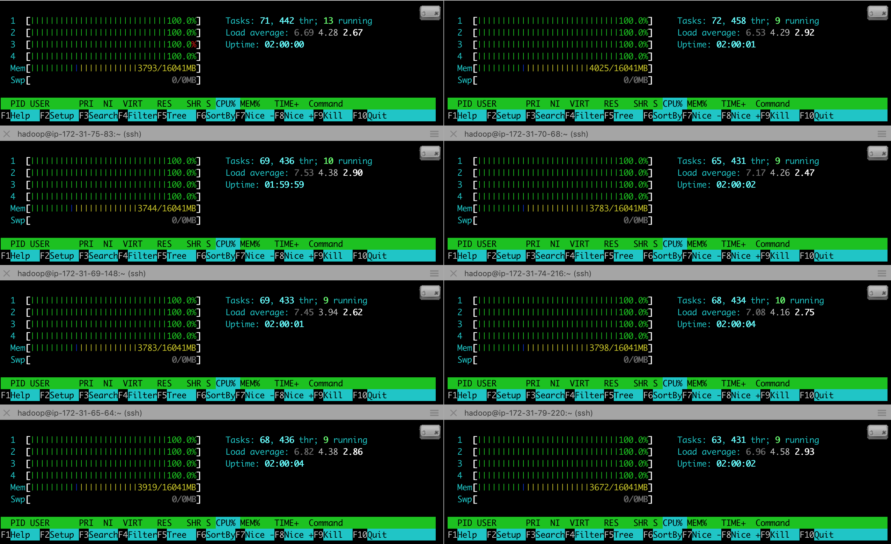

## Process

To measure scaling we used an AWS EMR cluster of 8 m4.xlarge workers with 4 cores each to compute historical analytics on the detected objects that we identified from 150 GB of video.

<!-- ## Theoretical Speedup

We use Gustafson's Law to calculate speedup: 

$$S=p+(1-p)s$$

Running 8 p2.xlarge instances as worker nodes gives $$p=8$$. We can then calculate the speedup for the two steps of our calculations.

<ol>
    <li>Create bounding boxes with NNs (fully parallelizable, store boxes in s3)</li>
    $$S = 8 + (-7)0 = 8$$
    <li>Compute analytics from bounding boxes in Spark: 8 workers, 2 cores per worker, 2 threads per core</li>
    $$S=32$$

</ol>

TODO: Talk about performance -->

## Strong Scaling

Strong scaling (fixed problem size) of aggregation of 100 hours of bounding boxes into 20-minute windows

| # Executors (Row) / Cores (Col) | 1 | 2 | 3 | 4 |
| :-------------------: |:-:|:-:|:-:|:-:|:-:|
|           1           | 130.6036292552948 | 151.8580044269562 | 164.2707266330719 | 149.00747709274293 |
|           2           | 142.3604470252991 | 143.8039128780365 | 153.2352751255035 | 159.88366103172302 |
|           3           | 137.6322629451752 | 147.9056767940521 | 148.7119328022003 | 144.19866309165954 |
|           4           | 134.2263833522797 | 135.0394935131073 | 124.2541794300079 | 131.04245553016662 |
|           5           | 143.3751981735230 | 135.3142168521881 | 115.2301400184631 | 117.34413194656372 |
|           6           | 133.5113302230835 | 115.5624811649323 | 111.8524597167969 | 107.45588517189026 |
|           7           | 128.5110889911652 | 106.3509711265564 | 103.2844680309296 | 103.79440789222717 |
|           8           | 118.0175147533417 | 95.38883476257324 | 98.73593525886535 | 91.498237657547 |

