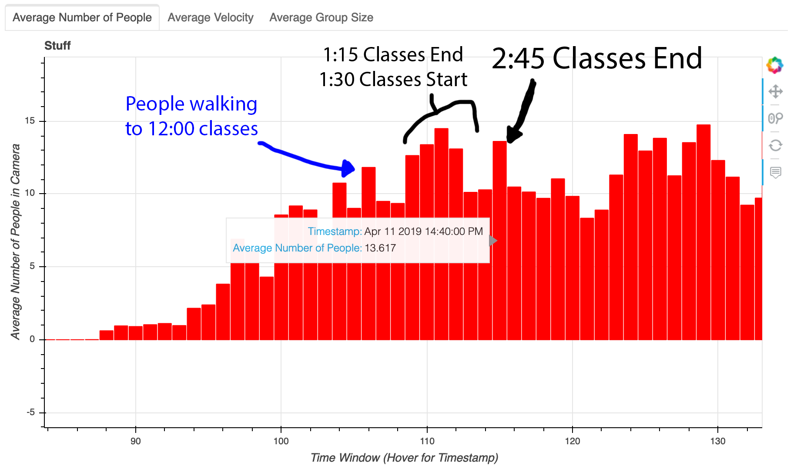
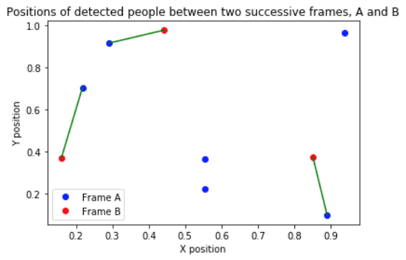

Here are some visualizations of what the detections look like.

## Plaza Metrics

### Average Number of People in the Plaza

Ever wonder when people are around the plaza the most?
We're able to see when people start moving around the square, and how many
people are moving at any point in time.
We count the number of people in the square at any point in time.
For example, here is a bar chart for the average number of people in the plaza,
while aggregating with a window of 20 minutes for Thursday, April 11.
We are able to see from the aggregated analytics when classes finish.

If you want to explore a subset of the data yourself,
check out this interactive graph.
There are a few icons on the right side of the graph for the controls.
When every control is toggled, you can use your scroll wheel to zoom in
or zoom out, and click and drag to move the graph around.
Furthermore, you can get a detailed timestamp and information by hovering
over the individual bars.

<iframe src="interactive_analytics_graph.html"
        sandbox="allow-same-origin allow-scripts"
        width="750"
        height="500"
        align="center"
        scrolling="no"
        seamless="seamless"
        frameborder="0" style="display: block; margin-left: auto; margin-right: auto; width: 500">
</iframe>

### Average Velocity

In order to compute the average velocity in each frame, we must consider the detected objects in the next frame. For person A in frame i, we need to identify the location of person A in frame i+1, and then approximate the velocity in frame i by dividing the distance traveled (between person A's centers) by the time, which is the inverse of the fps (frames per second).

So, first, we must link people between frames. Since people are constantly entering and leaving the frame, the number of objects per frame (n_i) may not be consistent between successive frames. Therefore, for each frame, we can compute at most min(n_i, n_{i+1}) velocities. We compute pairwise distances between all objects in different frames, sort the pairs in ascending order of distance, and then greedily label each unassigned object in frame i to the closest unassigned object in frame i+1. We account for the edge case of a person leaving one end of the frame and another person entering on the opposite side of the next frame by only linking people whose distance is within a predefined threshold of 30% of the frame width or length. In particular, we compute the Euclidean distance between the centers (where the two dimensions of the centers are in [0, 1] as proportions of the frame dimension length), and then do not link objects if the distance exceeds 0.3.

Here is an example image, where the first frame (A) has 6 detected people, and the second frame (B) has 3 detected people. The green lines denote the link, and the velocity is computed as the length of the green line times the fps.

 

## Hotspots

How does the distribution of people in the plaza change over time?
Check out the heatmap of where people are standing in the image here.
This is just the how the distribution of people in the plaza evolves
over the day.
The specific day depicted in the video was April 10, 2019.

<iframe width="640" height="360" src="https://www.youtube.com/embed/JhHHnR9V0NI"
        frameborder="0"
        allow="accelerometer; autoplay; encrypted-media; gyroscope; picture-in-picture" allowfullscreen
        class="youtube"
        style="padding:10px;"></iframe>

We see that in the mornings, the distirbution is relatively uniform along
the plaza, and occupy where the food trucks are (since the food trucks
don't come until noon).
Then, we can see the different paths through the plaza light up as
students try to get to class, and also the paths taken by tourists.
We also see hotspots at the food trucks around 1 PM, from people eating
lunch.

## Looking at the Detections

It's also nice to be able to look at the detections themselves.
We are able to get the detections and plot different classes to check if the
detections are reasonable.

<iframe width="640" height="360" src="https://www.youtube.com/embed/eN9tTVJ9J2c"
        frameborder="0"
        allow="accelerometer; autoplay; encrypted-media; gyroscope; picture-in-picture" allowfullscreen class="youtube"
        style="padding:20px;"></iframe>
