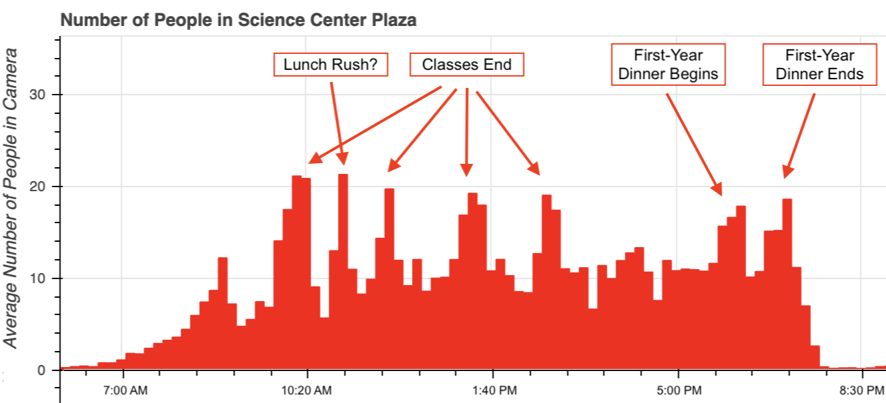
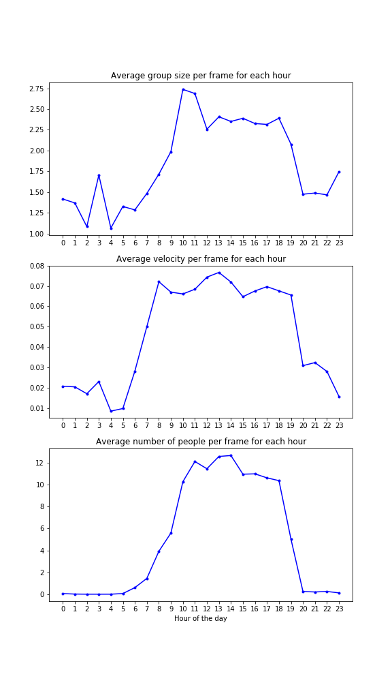

Here are some visualizations of what the detections look like.

## Plaza Metrics

### Average Number of People in the Plaza

Ever wonder when people are around the plaza the most?
We're able to see when people start moving around the square, and how many
people are moving at any point in time.
We count the number of people in the square at any point in time.
For example, here is a bar chart for the average number of people in the plaza,
while aggregating with a window of 20 minutes for Thursday, April 11.
We are able to see from the aggregated analytics when classes finish.

 

If you want to explore a subset of the data yourself,
check out this interactive graph.
There are a few icons on the right side of the graph for the controls.
When every control is toggled, you can use your scroll wheel to zoom in
or zoom out, and click and drag to move the graph around.
Furthermore, you can get a detailed timestamp and information by hovering
over the individual bars.

<iframe src="interactive_analytics_graph.html"
        sandbox="allow-same-origin allow-scripts"
        width="750"
        height="500"
        align="center"
        scrolling="no"
        seamless="seamless"
        frameborder="0" style="display: block; margin-left: auto; margin-right: auto; width: 500">
</iframe>

## Hotspots

How does the distribution of people in the plaza change over time?
Check out the heatmap of where people are standing in the image here.
This is just the how the distribution of people in the plaza evolves
over the day.
The specific day depicted in the video was April 10, 2019.

<iframe width="640" height="360" src="https://www.youtube.com/embed/JhHHnR9V0NI"
        frameborder="0"
        allow="accelerometer; autoplay; encrypted-media; gyroscope; picture-in-picture" allowfullscreen
        class="youtube"
        style="padding:20px;"></iframe>

We see that in the mornings, the distribution is relatively uniform along
the plaza, and occupy where the food trucks are (since the food trucks
don't come until noon).
Then, we can see the different paths through the plaza light up as
students try to get to class, and also the paths taken by tourists.
We also see hotspots at the food trucks around 1 PM, from people eating
lunch.

## Looking at the Detections

It's also nice to be able to look at the detections themselves.
We are able to get the detections and plot different classes to check if the
detections are reasonable.

<iframe width="640" height="360" src="https://www.youtube.com/embed/eN9tTVJ9J2c"
        frameborder="0"
        allow="accelerometer; autoplay; encrypted-media; gyroscope; picture-in-picture" allowfullscreen class="youtube"
        style="padding:20px;"></iframe>

## Historical Data

Once we analyzed the video recordings in the science center, we are able to
get historical averages of common statistics like number of people, velocity,
and group size, and alert the user if current conditions differ greatly
from historical averages.
For comparing our streaming analytics with history, we averaged all of the
statistics over hour periods and compare.
The statistics over each hour period for the month of April looked like this.

 

Then, using these historical averages, we alert the user when our livestream
differs by too much.
This alert can be implemented to look something like this.

<iframe width="640" height="360" src="https://www.youtube.com/embed/HT1Xs0Hrt_M"
        frameborder="0"
        allow="accelerometer; autoplay; encrypted-media; gyroscope; picture-in-picture" allowfullscreen class="youtube"
        style="padding:20px;"></iframe>
